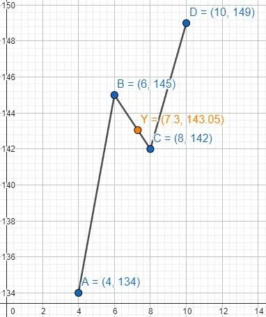

# Tarea 8 - Interpolación Polinomial Simple

> **Nombre:** Alan Yahir Juárez Rubio
> **Fecha de elaboración:** 15/10/2023
> **Fecha límite de entrega:** 15/10/2023

## Ejercicio 1

En un laboratorio de investigación se desea estudiar la forma cómo se relaciona el porcentaje de fibra de madera y la resistencia del producto final. Los datos se muestran a continuación

| % de fibra de madera |  4  |  6  |  8  | 10  |
| :------------------: | :-: | :-: | :-: | :-: |
|     Resistencia      | 134 | 145 | 142 | 149 |

Realizar la **interpolación gráfica** y la **numérica** para el porcentaje de fibra del 7.3% con:

1. Polinomio de grado 1
2. Polinomio de grado 2 hacia atrás (izquierda)
3. Polinomio de grado 2 hacia adelante (derecha)

> [!NOTE]
>
> Recuerda encerrar el polinomio interpolador y el valor de la aproximación interpolar (tal como se hizo en clase)

### Interpolación gráfica

### Polinomio de grado 1

$$
\begin{cases}
a_0 &+& 6a_1 &=& 145 \\
a_0 &+& 8a_1 &=& 142
\end{cases} \Rightarrow
(a_0, a_1) = \left(154, -\frac{3}{2}  \right)
$$

> [!DONE] Respuestas
>
> $$y = 154 - \cfrac{3}{2}x \tag{Polinomio Interpolador}$$
>
> $$y(7.3) = 143.05000 \tag{Aproximación Interpolar}$$

### Polinomio de grado 2 hacia atrás

$$
\begin{cases}
a_0 &+& 4a_1 &+& 16a_2 &=& 134 \\
a_0 &+& 6a_1 &+& 36a_2 &=& 145 \\
a_0 &+& 8a_1 &+& 64a_2 &=& 142
\end{cases} \Rightarrow
(a_0, a_1, a_2) = \left(70, 23, -\frac{7}{4}  \right)
$$

> [!DONE] Respuestas
>
> $$y = 70 + 23x -\cfrac{7}{4}x^2 \tag{Polinomio Interpolador}$$
>
> $$y(7.3) = 144.6425 \tag{Aproximación Interpolar}$$

### Polinomio de grado 2 hacia adelante

$$
\begin{cases}
a_0 &+& 6a_1 &+& 36a_2 &=& 145 \\
a_0 &+& 8a_1 &+& 64a_2 &=& 142 \\
a_0 &+& 10a_1 &+& 100a_2 &=& 149
\end{cases} \Rightarrow
(a_0, a_1, a_2) = \left(214, -19, \frac{5}{4} \right)
$$

> [!DONE] Respuestas
>
> $$y = 214 -19x + \cfrac{5}{4}x^2 \tag{Polinomio Interpolador}$$
>
> $$y(7.3) = 141.9125 \tag{Aproximación Interpolar}$$

## Ejercicio 2

Se presentas los datos de ebullición de la acetona a diferentes presiones

|     T °C      | 56.5 | 78.6 | 113 | 114.5 |
| :-----------: | :--: | :--: | :-: | :---: |
| Presión (atm) |  1   |  2   |  5  |  10   |

Realizar la **interpolación gráfica** y la **numérica** para la temperatura para una presión de 1.5 con:

1. Polinomio de grado 1
2. Polinomio de grado 2 hacia adelante (derecha)
3. Polinomio de grado 3 (usar todos los puntos)

### Interpolación gráfica

### Polinomio de grado 1

$$
\begin{cases}
a_0 &+& a_1 &=& 56.5 \\
a_0 &+& 2a_1 &=& 78.6
\end{cases} \Rightarrow
(a_0, a_1) = (34.4, 22.1)
$$

> [!DONE] Respuestas
>
> $$y = 32.4 + 22.1x \tag{Polinomio Interpolador}$$
>
> $$y(1.5) = 67.55 \tag{Aproximación Interpolar}$$

### Polinomio de grado 2 hacia adelante

$$
\begin{cases}
a_0 &+& a_1 &+& a_2 &=& 56.5 \\
a_0 &+& 2a_1 &+& 4a_2 &=& 78.6 \\
a_0 &+& 5a_1 &+& 25a_2 &=& 113
\end{cases} \Rightarrow
(a_0, a_1, a_2) = \left(\frac{349}{12}, \frac{1203}{40}, -\frac{319}{120}\right)
$$

> [!DONE] Respuestas
>
> $$y = \frac{349}{12} + \frac{1203}{40}x - \frac{319}{120}x^2 \tag{Polinomio Interpolador}$$
>
> $$y(1.5) = 68.21458 \tag{Aproximación Interpolar}$$

### Polinomio de grado 3 (todos los puntos)

$$
\begin{cases}
a_0 &+&   a_1 &+&    a_2 &+&     a_3 &=& 56.5 \\
a_0 &+&  2a_1 &+&   4a_2 &+&    8a_3 &=& 78.6 \\
a_0 &+&  5a_1 &+&  25a_2 &+&  125a_3 &=& 113 \\
a_0 &+& 10a_1 &+& 100a_2 &+& 1000a_3 &=& 114.5 \\
\end{cases} \Rightarrow
(a_0, a_1, a_2, a_3) = \left(\frac{1993}{72} + \frac{23371}{720} - \frac{1361}{360} + \frac{101}{720} \right)
$$

> [!DONE] Respuestas
>
> $$y = \frac{1993}{72} + \frac{23371}{720}x - \frac{1361}{360}x^2 + \frac{101}{720}x^3 \tag{Polinomio Interpolador}$$
>
> $$y(1.5) = 68.33733 \tag{Aproximación Interpolar}$$

## Ejercicio 3

Usa la **interpolación** con todos los puntos para aproximar el valor de $y$ para $x = 3.8$. Los datos son:

|  x   |  1.4  |  2.6  |  3.2  |  4.5  |
| :--: | :---: | :---: | :---: | :---: |
| f(x) | 0.725 | 0.548 | 0.423 | 0.173 |

1. Escriba el **polinomio interpolador**
2. Aproxime el valor de $y$ para $x = 3.8$
3. Realice la **intepolación gráfica**

### Interpolación gráfica

### Polinomio de grado 3 (todos los puntos)

$$
\begin{cases}
a_0 &+& 1.4a_1 &+&  1.96a_2 &+&  2.744a_3 &=& 0.725 \\
a_0 &+& 2.6a_1 &+&  6.76a_2 &+& 17.576a_3 &=& 0.548 \\
a_0 &+& 3.2a_1 &+& 10.24a_2 &+& 32.768a_3 &=& 0.423 \\
a_0 &+& 4.5a_1 &+& 20.25a_2 &+& 91.125a_3 &=& 0.173 \\
\end{cases} \Rightarrow
(a_0, a_1, a_2, a_3) = (0.64980, 0.21164, -0.13188, 0.01362)
$$

> [!DONE] Respuestas
>
> $$y = 0.64980 + 0.21164x - 0.13188x^2 + 0.01362x^3 \tag{Polinomio Interpolador}$$
>
> $$y(3.8) = 0.29704 \tag{Aproximación Interpolar}$$
